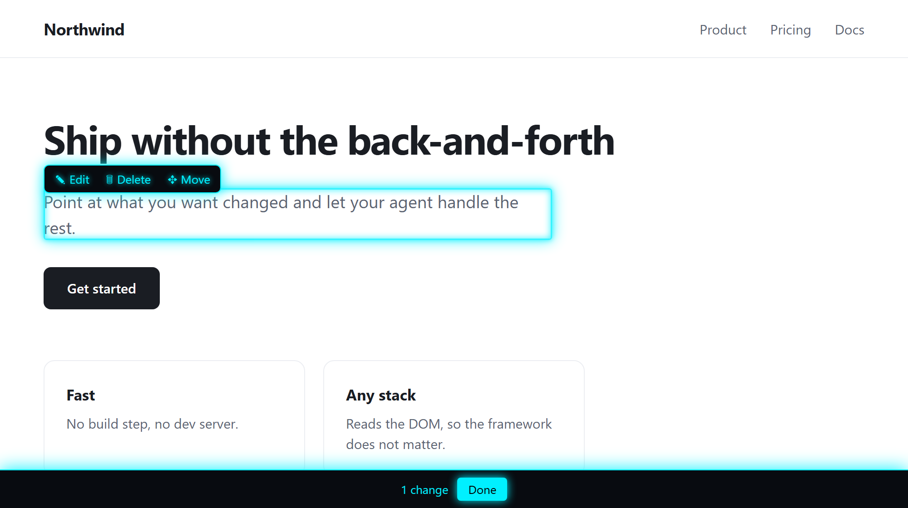

# Pick 

**Change a website by clicking the thing you want changed.**

Instead of typing *"the subtitle under the heading in the third pricing card"*,
you hover it in your own browser, press a button, and your coding agent makes
the change in the source.

```
hover an element  →  ✎ Edit / 🗑 Delete / ✥ Move  →  Done  →  /pick
```

The page updates instantly as a preview. Nothing is written to disk until you
run `/pick` and the agent applies the batch to your actual source files.



## Install

Two parts: the skill (so your agent knows what to do with a pick) and the
extension (so you can pick).

**1. The skill**

```
npx skills add Poellie01/pick -g
```

**2. The extension**

- **Chrome / Edge / Brave / Arc** — `chrome://extensions` → enable
  **Developer mode** → **Load unpacked** → select the skill's folder.
  
Ask your agent for the folder path — it differs between a global and a
project install.

Then press the toolbar button or **Alt+Shift+K** on any page. 

## The three buttons

| | |
|---|---|
| **✎ Edit** | Text becomes editable in place. Existing text is selected, so typing replaces it; click once to place a caret instead. Only appears on elements that actually hold text. |
| **🗑 Delete** | Removes the element. |
| **✥ Move** | Press and hold, drag to the destination, release. A glowing line shows exactly where it will land — above or below the element you are over. |

Esc cancels. **Done** copies the batch to your clipboard.

## What gets sent

A markdown list — one line per change, each naming a CSS selector and the
element's visible text, plus the page URL. Nothing else leaves the page. No
server, no telemetry, no network calls at all.

## Options

Extension **Details → Extension options** sets the accent colour, with a
native colour picker and six presets. Saves on change; the next launch uses it.

## Requires

An agent that supports skills, e.g. Claude Code and a chromium based browser, e.g. Chrome, Edge, Brave, Arc.

## License

GPL-3.0 — see [LICENSE](LICENSE).
